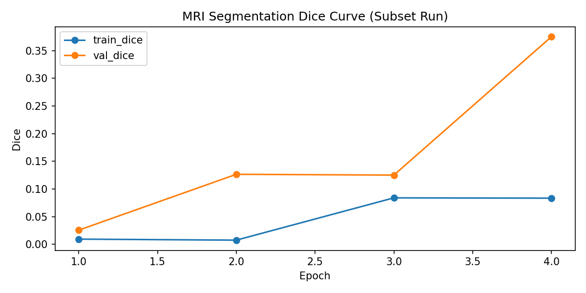
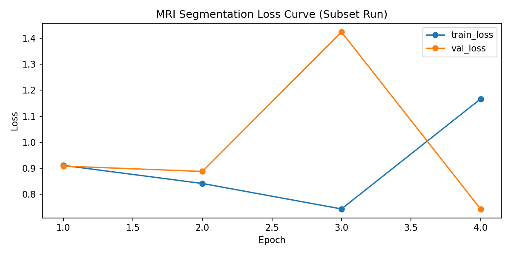
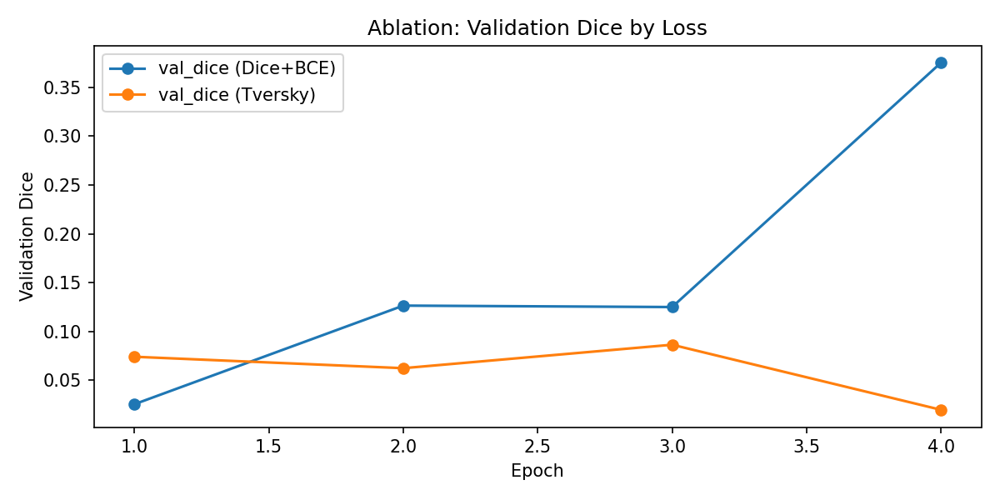
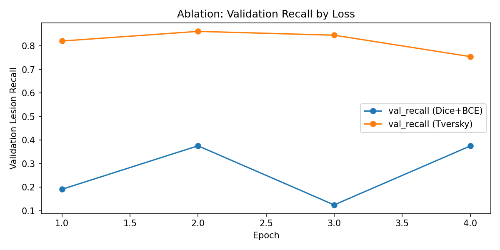

# MRI Lesion Segmentation

## Objective
Segment lesion regions from 3D MRI volumes with robust handling of foreground-background imbalance.

## Method
- Residual 3D U-Net architecture.
- Lesion-aware patch sampling.
- Dice+BCE and Tversky loss options.
- Epoch-level tracking of Dice, IoU, and lesion recall.

## Repository Structure
- `notebooks/` experiment notebooks (`mri_deep_dive.ipynb` as the main entry).
- `src/mri_seg/` training/inference modules.
- `scripts/` one-command training/inference scripts.
- `results/` metrics tables.
- `assets/` training and ablation figures.
- `models/` checkpoints.
- `data/` local MRI data directory (not versioned).

## Run
1. Install dependencies: `pip install -r requirements.txt`
2. Put MRI images/masks under `data/train/`.
3. Train: `./scripts/train_mri.sh`
4. Inference: `./scripts/infer_mri.sh`

## Current Experimental Results
Subset experiment metrics and ablation summaries are stored in:
- `results/metrics.csv`
- `results/ablation_summary.csv`
- `results/subset_run_summary.txt`

## Figures

